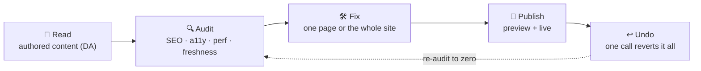
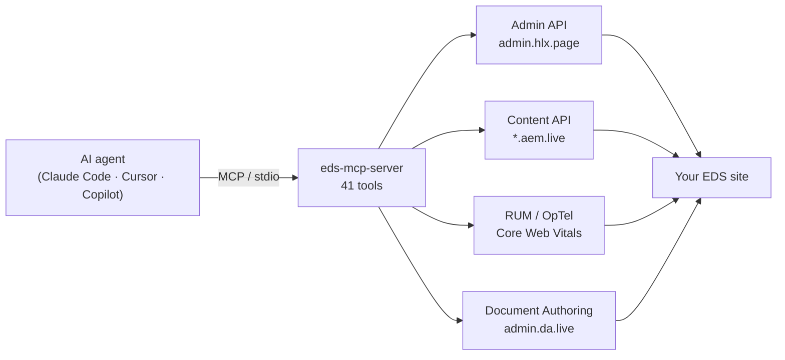
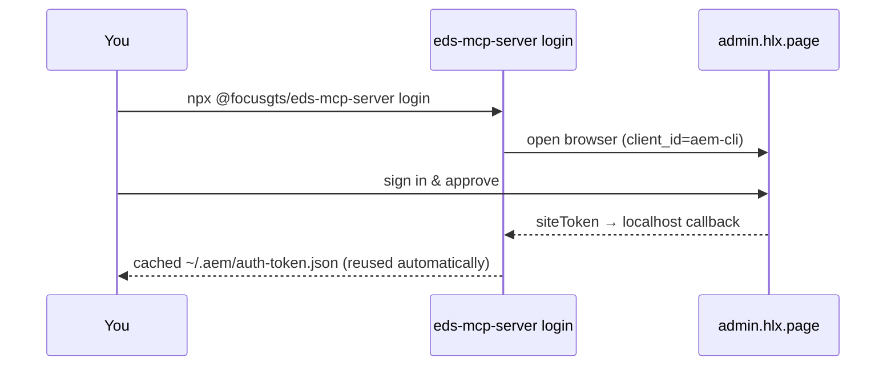

<div align="center">


[](https://www.npmjs.com/package/@focusgts/eds-mcp-server)
[](https://www.npmjs.com/package/@focusgts/eds-mcp-server)
[](https://registry.modelcontextprotocol.io)
[](https://github.com/punkpeye/awesome-mcp-servers)
[](LICENSE)

### Let an AI agent run — and *improve* — your Adobe Edge Delivery site.

**41 tools. No extra dependencies beyond the MCP SDK. Works with any EDS site.**
The first MCP server purpose-built for Edge Delivery Services.

**Read your content → audit it → fix what's wrong → publish → undo any of it.**
One page or the whole site, in a single reversible operation. Preview before every write; undo after.


</div>

---

## ⚡ Do it in three lines

```bash
claude mcp add eds -e EDS_OWNER=your-org -e EDS_REPO=your-site -- npx @focusgts/eds-mcp-server
```

Then just ask your agent:

> *"Audit the whole site and show me what's hurting SEO."*
> *"Fix the meta description on every page that's missing one — preview first, then publish."*
> *"Actually, undo that whole batch."*
> *"Preview and publish the homepage."*

That's it — no local AEM, no scripts, no glue code. Every write is previewable and reversible.

### The loop that makes it different



It doesn't just *drive* your site — it **improves** it, safely. Point it at an EDS site and an agent can find what's wrong and repair it, one page or the whole site in a single batch that a single `eds_da_rollback` reverts. No other MCP server — including Adobe's own — does this end-to-end.

---

## 🧠 How it works



The agent calls tools; the server talks to the live EDS infrastructure. Read-only tools (content, sitemap, metadata) need no credentials at all.

---

## 🔑 One-click sign-in

No more pasting a fresh admin token every day:



> Use Chrome or Firefox — Safari blocks the local callback (same as Adobe's AEM CLI). `EDS_API_KEY` works as the CI / fallback path.

---

## 🛠️ The 41 tools

### Edge Delivery Services — publish, content, analytics

<table>
<tr><td valign="top" width="33%">

**Publishing**
- `eds_preview_page`
- `eds_publish_page`
- `eds_unpublish_page`
- `eds_preview_and_publish`
- `eds_get_status`
- `eds_purge_cache`
- `eds_bulk_preview`
- `eds_bulk_publish`
- `eds_get_job_status`

</td><td valign="top" width="33%">

**Content**
- `eds_get_page`
- `eds_list_pages`
- `eds_search_pages`
- `eds_get_metadata`
- `eds_get_sitemap`
- `eds_get_redirects`

</td><td valign="top" width="33%">

**Analytics & config**
- `eds_get_cwv`
- `eds_get_404s`
- `eds_get_experiments`
- `eds_get_config`
- `eds_get_logs`
- `eds_get_api_keys`

</td></tr>
</table>

### Document Authoring (DA) — the authored *source*, not the rendered output

Nine tools reach a site's Document Authoring source directly (`admin.da.live`), the source of truth behind an EDS site. Requires `EDS_DA_TOKEN`.

<table>
<tr><td valign="top" width="33%">

**Read**
- `eds_da_list_sources`
- `eds_da_get_source`
- `eds_da_get_versions`

</td><td valign="top" width="33%">

**Write**
- `eds_da_put_source`
- `eds_da_delete_source`
- `eds_da_copy_source`
- `eds_da_move_source`

</td><td valign="top" width="33%">

**Bulk ("clone") + safe writes**
- `eds_da_export`
- `eds_da_push`
- `eds_da_rollback`

</td></tr>
</table>

> **`eds_da_export` / `eds_da_push`** bring the efficiency of `aem content clone` to agents: export a whole DA subtree in **one** call, operate on it, and push the batch back in **one** call — no local checkout, no `aem-cli`. Same model, network-native.
>
> **Safe by default.** `eds_da_push` takes `dryRun: true` to **preview** exactly what a bulk edit would do (create / update / unchanged, with line-diff counts) without writing a thing, and `withUndo: true` to make the write **reversible** — it returns an `undo` object you hand to `eds_da_rollback` to restore prior content and remove any docs the push created. Preview before writing, undo after: the difference between an impressive demo and something you'd point at a production site.
>
> `EDS_DA_TOKEN` is an Adobe IMS access token for Document Authoring — grab it from an authenticated [da.live](https://da.live) session (the IMS `access_token`). Document paths assume `.html` when no extension is given (`index` → `index.html`).

### Content audit — find what's wrong, before you fix it

- `eds_audit_page`
- `eds_audit_site`
- `eds_audit_report`
- `eds_audit_snapshot`
- `eds_audit_trend`
- `eds_audit_monitor`

> **It tells you what's wrong.** `eds_audit_site` sweeps the whole site (or a subtree) and returns a **prioritized** list of issues across **SEO** (missing titles/descriptions, no H1, blocked from indexing), **accessibility** (images without alt text, missing landmarks, unlabeled form inputs), **freshness** (pages not updated in over a year), **sitemap coverage**, and — with a `domain` — **performance** (Core Web Vitals) and **404s** from Adobe's own real-user data. `eds_audit_page` does the same for one page. Read-only and safe to run anytime.
>
> **`eds_audit_report`** turns that audit into a **beautiful, client-ready HTML report** — a Focus GTS Navigator letterhead, an executive summary, per-dimension health scores, a prioritized issue list with each suggested fix, and a **Save-as-PDF** button (uses your browser's own print — no dependency). Self-contained (no external assets), ready to open, host, or send to a stakeholder. Pass an optional `brand` (agency name, logo, accent, "prepared for" client) to white-label the letterhead.
>
> **Track it over time.** `eds_audit_snapshot` records each audit's scores to a history sheet in your site's own content (private by default) and tells you the change since last time — *"89, ▲7 since last week."* **`eds_audit_trend`** turns that history into a shareable HTML **sparkline** of your score over time plus per-dimension movement. One snapshot is a mirror; the trend is the story.
>
> **Watch it on autopilot.** `eds_audit_monitor` audits, **diffs against the last snapshot**, and reports a status — **ok / degraded / broken** — and, when you give it a `webhook`, **pings Slack/Discord the moment health breaks** (a new critical, or a dimension fallen to poor). The server does the check + alert; you supply the schedule — a copy-paste **[scheduled GitHub Action](examples/monitor.yml)** or your agent runtime. Webhook is https-only and the payload carries no secrets.

### Safe fixes — repair what the audit finds

- `eds_fix_metadata`
- `eds_bulk_fix_metadata`
- `eds_fix_redirect`
- `eds_fix_audit`

> **It fixes what it finds — reversibly.** `eds_fix_metadata` repairs a page's title, meta description and Open Graph image by editing its Document Authoring source, routed through the same **dry-run + undo** path as the write tools. The agent supplies the content (e.g. writes a fitting description); the tool writes it *correctly and idempotently* (merges into the page's Metadata block, never duplicates it). Pass `publish: true` to preview + publish so the change goes live.
>
> **`eds_bulk_fix_metadata`** does it across a **whole site in one reversible operation** — pass a list of `{ path, metadata }`, and it writes every changed page in a single batch that returns **one** undo reverting all of it. The full loop: **`eds_audit_site` → fix the batch → publish → re-audit to zero** — with a single undo if anything looks off.
>
> **`eds_fix_redirect`** closes the 404 loop: `eds_audit_site` surfaces the broken links from real-user data, and this adds the **301 redirect rules** (to the site's `redirects` sheet) that fix them — one rule or many, idempotent, dry-run + undo. So the audit now has a fix for *every* major finding.
>
> **`eds_fix_audit`** is the "fix it" button in agent form: after an audit, apply its fixable findings — metadata **and** redirects together — in **one reversible batch**. Findings the report marks **✦ Fixable** carry a machine-readable fix; you supply the values (the tool never invents copy), and every change is pushed at once so a **single** `eds_da_rollback` undoes all of it. `dryRun` previews the whole plan; `publish: true` makes it live.

---

## 🔌 Add it to your tool

<details open>
<summary><b>Claude Code</b> — one command</summary>

```bash
claude mcp add eds -e EDS_OWNER=your-org -e EDS_REPO=your-site -- npx @focusgts/eds-mcp-server
```
</details>

<details>
<summary><b>Cursor</b> — <code>.cursor/mcp.json</code></summary>

```json
{
  "mcpServers": {
    "eds": {
      "command": "npx",
      "args": ["@focusgts/eds-mcp-server"],
      "env": { "EDS_OWNER": "your-org", "EDS_REPO": "your-site" }
    }
  }
}
```
</details>

<details>
<summary><b>VS Code (GitHub Copilot)</b> — <code>.vscode/mcp.json</code></summary>

```json
{
  "servers": {
    "eds": {
      "command": "npx",
      "args": ["@focusgts/eds-mcp-server"],
      "env": { "EDS_OWNER": "your-org", "EDS_REPO": "your-site" }
    }
  }
}
```
</details>

---

## ⚙️ Configuration

| Variable | Required | Description |
|----------|----------|-------------|
| `EDS_OWNER` | Yes | GitHub org/user that owns the EDS site repo |
| `EDS_REPO` | Yes | GitHub repository name |
| `EDS_REF` | No | Git branch (default: `main`) |
| `EDS_API_KEY` | No | Admin token (see Authentication). Browser login is the alternative. |
| `EDS_DOMAIN_KEY` | No | OpTel domain key for analytics queries (CWV, 404s, experiments) |
| `EDS_DA_TOKEN` | No | Document Authoring IMS access token — enables the `eds_da_*` source & bulk tools |
| `EDS_DA_ORG` | No | DA org (defaults to `EDS_OWNER`) |
| `EDS_DA_REPO` | No | DA repo/site (defaults to `EDS_REPO`) |

**Read-only tools** (content, sitemap, metadata) need no keys. **Write tools** (preview, publish, cache) need an admin token. **Analytics tools** need `EDS_DOMAIN_KEY`. **DA source tools** need `EDS_DA_TOKEN`.

---

## 🔐 Authentication

Admin operations require an EDS Admin token. Two ways to provide one.

**Browser sign-in (recommended for interactive use)**

```bash
EDS_OWNER=your-org EDS_REPO=your-site npx @focusgts/eds-mcp-server login
```

Opens your browser to Adobe's `admin.hlx.page` login (the same flow as the AEM CLI). The admin site token caches at `~/.aem/auth-token.json` (mode `0600`, ~24h) and is reused automatically. **Use Chrome or Firefox — Safari blocks the local callback.**

**`EDS_API_KEY` (CI / automation, and the fallback)** — always takes precedence when set.

```bash
EDS_OWNER=your-org EDS_REPO=your-site EDS_API_KEY=<your-admin-token> npx @focusgts/eds-mcp-server
```

To get a token (per [Adobe's API key docs](https://www.aem.live/docs/admin-apikeys)): sign in at `https://admin.hlx.page/login`, then copy the `auth_token` cookie value from DevTools — or copy the `x-auth-token` header from an authenticated AEM Sidekick request. For a durable credential, configure a site API key.

---

## 🏗️ Architecture

Built following Adobe's MCP conventions (derived from `adobe-rnd/da-mcp`):

- TypeScript + `@modelcontextprotocol/sdk` + `zod`, stateless per request
- Tool naming: `eds_{verb}_{noun}` · stdio transport
- Native `fetch()` (Node 18+) — no HTTP dependencies

```bash
git clone https://github.com/Focus-GTS/eds-mcp-server.git
cd eds-mcp-server && npm install && npm run build && npm test
```

---

## 🧩 Part of the FocusGTS EDS suite

| | |
|---|---|
| [eds-content-ops-skills](https://github.com/Focus-GTS/eds-content-ops-skills) | AI skills for EDS content ops — first third-party contributor merged into [Adobe's official skills repo](https://github.com/adobe/skills) |
| [eds-ops](https://github.com/Focus-GTS/eds-ops) | CLI + GitHub Action for automated site grading and PR gating |
| [EDS Score](https://www.focusgts.com/eds-score/) | Free browser-based site health analyzer |

---

<div align="center">

Built by **[FocusGTS](https://focusgts.com)** — Adobe Silver Solution Partner · Apache-2.0
<br/>Not affiliated with or endorsed by Adobe Inc.

</div>
